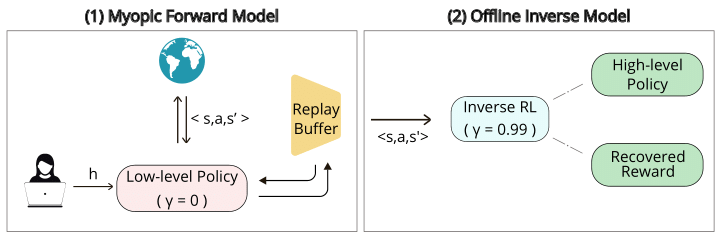

# INverse Forward Offline Reinforcement Model (INFORM)

### Codebase for : "Learning while sleeping: Integrating Sleep-Inspired Consolidation with Human Feedback Learning"

INFORM is a framework that scalably learns robust policies and reward functions from human feedback. The model consists of two phases : 
1. **A Forward model:** In this initial phase, we use a myopic interactive RL based on human feedback to train a preliminary, low-level policy.
2. **An Offline Inverse model:** Subsequently, we revisit all the trajectories generated by the previous phase and apply a non-myopic offline IRL to derive a policy and reward function that more accurately capture the task's high-level objectives.

  

